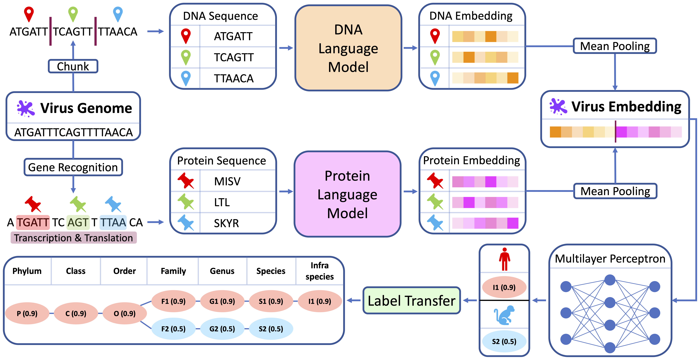

# VHSeek

This repository implements "VHSeek: Biology foundation model-based multimodal virus representations revealing virus host associations".

VHSeek combines `DNA and Protein Foundation Models` to build `Multimodal Virus Embeddings`, and uses these embeddings to predict `Associations between Viruses and Hosts` for all types of viruses (more than phage) and all taxonomy levels of host (from Infraspecies to Phylum).

## Quick links

* [Requirements](#requirements)
* [Data preparation](#data-preparation)
* [Reproduce all our experiments with only one file](#main)
* [Run VHSeek locally](#pipeline)
* [Citation](#citation)

## Requirements

1. Create a virtual environment
`conda create -y -n vhseek python=3.12`
2. Activate the virtual environment
`conda activate vhseek`
3. Install the required packages in the virtual environment
`bash requirements.sh`

## Data preparation

We have released our experiment data, which can be downloaded from [Zenodo](https://zenodo.org/records/14728501).

## Reproduce all our experiments with only one file

- Reproduce all our experiments with good visualization by following the steps in [main.ipynb](main.ipynb)

**Notice: main.ipynb outputs are saved in** `vhseek_data/experiment/test_result/notebook/`.

## Run VHSeek locally

- Run VHSeek locally by following the example in [pipeline.ipynb](pipeline.ipynb)

**Notice: the inputs and outputs of the example are saved in** `example/`.
